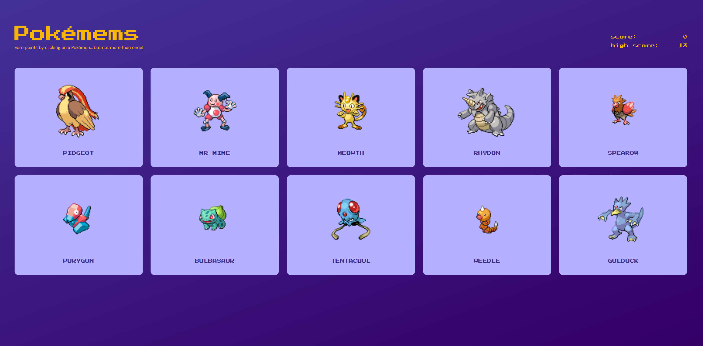

<!-- PROJECT SHIELDS -->

[![Issues][issues-shield]][issues-url]
[![MIT License][license-shield]][license-url]
[![LinkedIn][linkedin-shield]][linkedin-url]

<!-- PROJECT LOGO -->
 

  

<h3 align="center">Pokémems</h3>

  

    Fun and interactive game to test your memory, featuring the original 150 Pokémon!
     
     
    <a href="https://poke-mems.netlify.app/">View demo</a>
    ·
    <a href="https://github.com/henrylin03/pokemems/issues/new">Add issue</a>
  

<!-- ABOUT THE PROJECT -->

## About

Earn points by clicking on as many unique Pokémon cards as you can. But, if you click on the same Pokémon twice, the game ends.

Challenge yourself to try and set a new high score!

This project is part of [The Odin Project's](https://www.theodinproject.com/) "Full Stack JavaScript" course. Built in React (TypeScript), this project focuses on practising the implementation of:

1. React's [`useEffect`](https://react.dev/reference/react/useEffect) hook for consuming RESTful APIs. All Pokémon IDs, names, and images are fetched from the RESTful [PokéAPI](https://pokeapi.co/) using a custom hook `useAllPokemons`.
2. Styling React applications using [CSS modules](https://github.com/css-modules/css-modules).

### Built with

<!-- CONTRIBUTING -->

## Contributing

If you have a suggestion that would make Pokémems better, please feel free to [add an issue](https://github.com/henrylin03/pokemems/issues/new) and/or fork and create a pull request.

<!-- LICENSE -->

## License

Distributed under the MIT License. See `LICENSE.txt` for more information.

## Acknowledgements

- Masterball image by JorMxDos ([DeviantArt](https://www.deviantart.com/jormxdos/art/Masterball-933399093))
- Confused Psyduck image by Root@hausec ([Pik PNG](https://www.pikpng.com/transpng/ihbhhbT/))
- This README is heavily influenced by the ["Best-README-Template"](https://github.com/othneildrew/Best-README-Template)
- Markdown badges by [ileriayo](https://github.com/Ileriayo/markdown-badges)

(<a href="#readme-top">back to top</a>)

<!-- MARKDOWN LINKS & IMAGES -->

[issues-shield]: https://img.shields.io/github/issues/henrylin03/pokemems.svg?style=for-the-badge
[issues-url]: https://github.com/henrylin03/pokemems/issues
[license-shield]: https://img.shields.io/github/license/henrylin03/pokemems.svg?style=for-the-badge
[license-url]: https://github.com/henrylin03/pokemems/blob/main/LICENSE
[linkedin-shield]: https://img.shields.io/badge/-LinkedIn-black.svg?style=for-the-badge&logo=linkedin&colorB=555
[linkedin-url]: https://www.linkedin.com/in/henrylin03/
